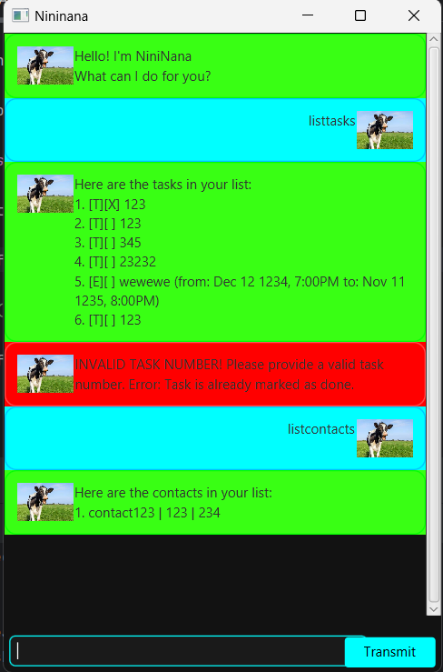

# Nininana ChatBot User Guide

Nininana is a desktop app for managing tasks, optimized for use via a Command Line Interface (CLI) while still having the benefits of a Graphical User Interface (GUI). If you can type fast, Tete can help you manage your tasks more efficiently than traditional GUI apps. Tete also provides the additional benefit of commentary, to add some fun to the usually drab process of task management. 

## Sample Screenshot


## Quick Start

### Prerequisites

Ensure you have **Java 17 or above** installed on your computer.

1. **Download the latest .jar file**.
2. Copy the file to your desired folder.
3. Open a command terminal, navigate (`cd`) into the folder where you placed the jar file.
4. Run the application using the command:
   ```sh
   java -jar Nininana.jar
   ```
5. A GUI should appear within a few seconds.
6. Type a command in the command box and press Enter to execute it.

### Example Commands
- `listtasks` : Lists all tasks.
- `marktasks INDEX(S)` : Marks the task at the given index/indices as completed.
- `unmarktasks INDEX(S)` : Unmarks the task at the given index/indices.
- `todo DESCRIPTION` : Adds a ToDo task with the given description.
- `deadline DESCRIPTION /by TIME` : Adds a Deadline task with a specified deadline [yyyy/mm/dd].
- `event DESCRIPTION /from START /to END` : Adds an Event task with a start [yyyy/mm/dd] and end [yyyy/mm/dd] time.
- `deletetasks INDEX` : Deletes the task at the specified index/indices.
- `findtasks KEYWORD` : Finds tasks containing the given keyword.
- `bye` : Nininana saves existing tasks and closes. 

Refer to the **Features** section below for details on each command.

## Features

### Viewing Help: `help`
Displays a message explaining how to access the help page.

**Format:**
```
help
```

### Adding a Task: `add`
Adds a new task to the task list.

**Format:**
```
todo DESCRIPTION
deadline DESCRIPTION /by TIME
event DESCRIPTION /from START /to END
```

**Examples:**
```
todo Read Book
deadline Submit Assignment /by 2025-02-02 [yyyy/mm/dd]
event Hackathon /from 2025-02-02 [yyyy/mm/dd] /to 2025-02-07 [yyyy/mm/dd]
```

### Listing All Tasks: `list`
Shows a list of all tasks.

**Format:**
```
listtasks
```

### Marking a Task as Done: `mark`
Marks the specified task as done.

**Format:**
```
marktasks INDEX
```

**Examples:**
```
marktasks 1
```

### Unmarking a Task: `unmark`
Marks the specified task as not done.

**Format:**
```
unmarktasks INDEX
```

**Examples:**
```
unmarktasks 1
```

### Finding Tasks: `find`
Finds tasks whose names contain any of the given keywords.

**Format:**
```
findtasks KEYWORD [MORE_KEYWORDS]
```

**Examples:**
```
findtasks book
findtasks assignment meeting
```

### Deleting a Task: `delete`
Deletes the specified task.

**Format:**
```
deletetasks INDEX
```

**Examples:**
```
deletetasks 3
```

### Exiting the Program: `bye`
Nininana gives a goodbye message.

**Format:**
```
bye
```

## Saving Data
- Tasks are **automatically saved** to the hard disk on closing the app.

## Editing the Data File
- The data is saved as a **text file**. 
- **Caution:** If you modify the file incorrectly, Nininana may fail to load the data properly.

## Command Summary

| **Action**  | **Format, Examples**  |
|------------|----------------------|
| **Add**    | `todo DESCRIPTION`  |
|            | `deadline DESCRIPTION /by TIME`  |
|            | `event DESCRIPTION /from START /to END`  |
| **Mark**   | `mark INDEX` (e.g., `mark 1`)  |
| **Unmark** | `unmark INDEX` (e.g., `unmark 1`)  |
| **Delete** | `delete INDEX` (e.g., `delete 3`)  |
| **Find**   | `find KEYWORD [MORE_KEYWORDS]` (e.g., `find book`)  |
| **List**   | `list`  |
| **Bye**    | `bye`  |
| **Help**   | `help`  |

For any further questions or issues, open an issue in the repository. Enjoy managing your tasks with Nininana!
