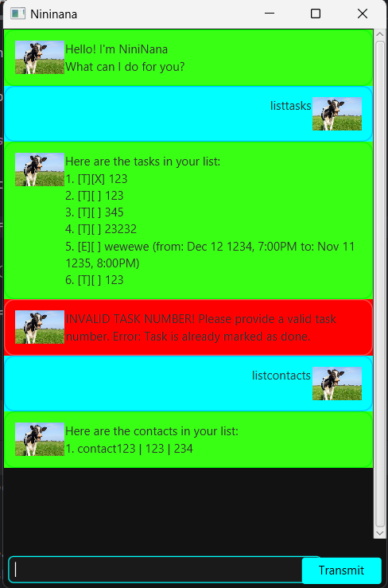

# NiniNana User Guide




## Introduction
NiniNana is a smart and intuitive chatbot that helps users efficiently manage their tasks and contacts. Whether you need to set deadlines, schedule events, or keep track of contacts, NiniNana is here to assist you with its user-friendly interface and powerful commands.

---

## Adding Deadlines
NiniNana allows you to add tasks with deadlines to keep track of important due dates.

### **Usage:**
```plaintext
deadline <description> /by <YYYY-MM-DD HH:mm>
```

### **Example:**
```plaintext
deadline Submit report /by 2025-03-15 23:59
```

### **Expected Output:**
```plaintext
Got it. I've added this task:
  [D][ ] Submit report (by: 2025-03-15 23:59)
Now you have X tasks in the list.
```

---

## Feature: Task Management
### **List All Tasks**
Displays all tasks currently saved in NiniNana.

#### **Usage:**
```plaintext
listtasks
```

#### **Expected Output:**
```plaintext
Here are the tasks in your list:
1. [T][ ] Buy groceries
2. [D][ ] Submit report (by: 2025-03-15 23:59)
3. [E][ ] Team meeting (from: 2025-03-16 10:00 to: 2025-03-16 12:00)
```

### **Mark a Task as Done**
Marks a specific task as completed.

#### **Usage:**
```plaintext
marktasks <task index>
```

#### **Example:**
```plaintext
marktasks 1
```

#### **Expected Output:**
```plaintext
Nice! I've marked this task as done:
  [T][X] Buy groceries
```

---

## Feature: Contact Management
### **Add a Contact**
Stores contact information including name, phone number, and email.

#### **Usage:**
```plaintext
addcontact <name> /p <phone number> /e <email>
```

#### **Example:**
```plaintext
addcontact John Doe /p 98765432 /e johndoe@example.com
```

#### **Expected Output:**
```plaintext
Got it. I've added this contact:
  John Doe | 98765432 | johndoe@example.com
```

### **List All Contacts**
Displays all saved contacts.

#### **Usage:**
```plaintext
listcontacts
```

#### **Expected Output:**
```plaintext
Here are your contacts:
1. John Doe | 98765432 | johndoe@example.com
2. Jane Smith | 91234567 | janesmith@example.com
```

---

## Exiting NiniNana
To exit the chatbot, simply use:
```plaintext
bye
```

### **Expected Output:**
```plaintext
Shutting down. Try not to break anything while I'm gone.
```

---

For more information or detailed command usage, refer to the official documentation. Enjoy using NiniNana!

